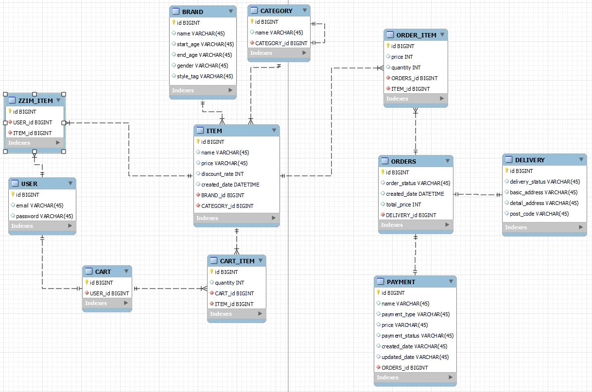
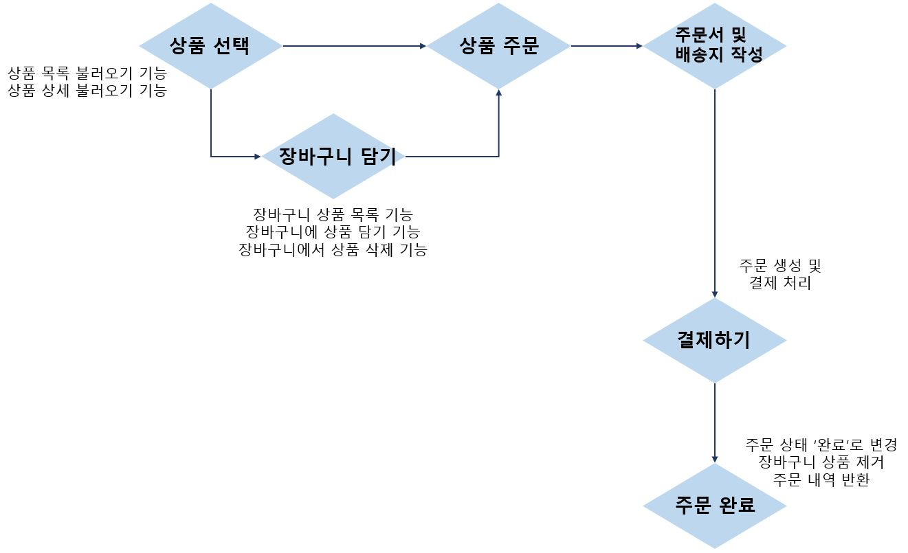
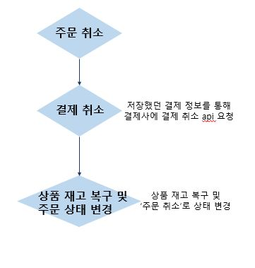

<h2> 주문 서비스 </h2>
 

<h3>주문에 필요한 도메인 파악 및 ERD 설계</h3>

JPA 엔티티 생성 시 주소(Address)와 관련된 속성을 객체로 묶어 Embedded 방식으로 처리하였으며,  
상태값 관련한 속성은 Enum을 활용하였습니다. 
다대다 관계의 테이블 경우 중간 테이블을 통해 연결하였습니다.

  

<h3>주문 처리 기능 흐름 파악 및 API 설계</h3>

<a href="src/main/resources/API-Spec.md">API 명세 확인하기</a>

  

- 기능 설명
  - 상품
    - 상품 목록 불러오기
      - 특정 카테고리, 브랜드 아이디로 상품을 가져오거나 상품명 검색, 상품 정렬이 가능합니다.
    - 상품 상세 사져오기
     
  - 장바구니
    - 사용자의 장바구니에 있는 장바구니상품 목록을 가져올 수 있습니다.
    - 장바구니에 상품을 담을 수 있습니다.
    - 장바구니에서 상품을 제거할 수 있습니다.
     
  - 주문
    - 하나 또는 여러 상품을 주문할 수 있습니다.
    - 모든 주문 내역을 확인할 수 있습니다. (주문상품 목록 포함)
    - 특정 주문 내역을 확인할 수 있습니다. (주문상품 목록 포함)
    - 주문을 취소할 수 있습니다.
    
 

- API 응답과 예외
  - API 응답은 ApiResponseDto로 통일하였으며, 상태에 따라 success 또는 failed를 반환합니다.
  - 예외가 발생할 경우 전역 예외 핸들러를 통해 예외 응답을 반환하도록 하였습니다.

 

- Postman을 통한 Api 동작 결과를 resources 파일에 첨부합니다.

 
